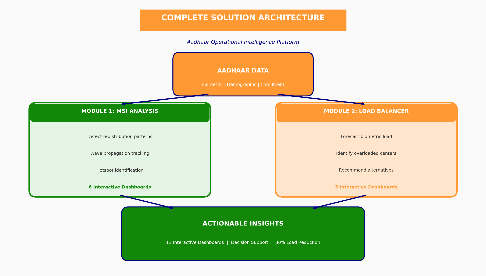
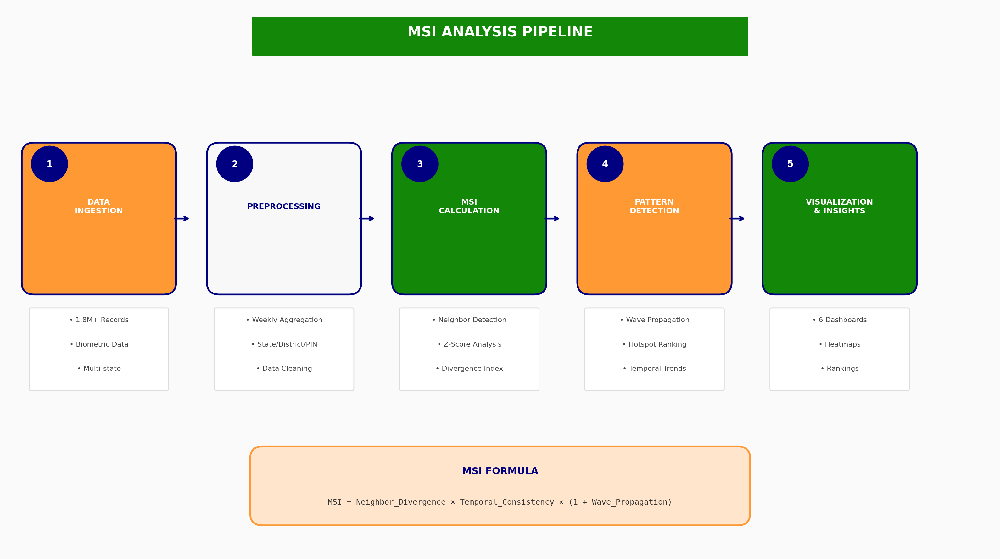
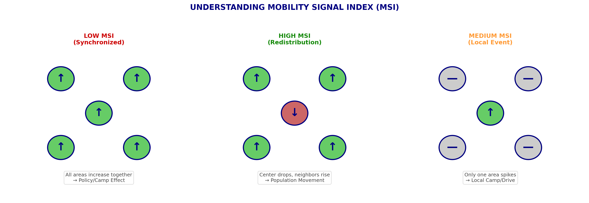
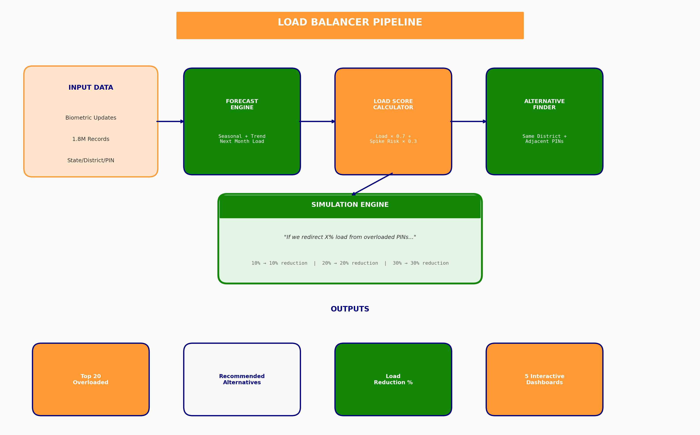
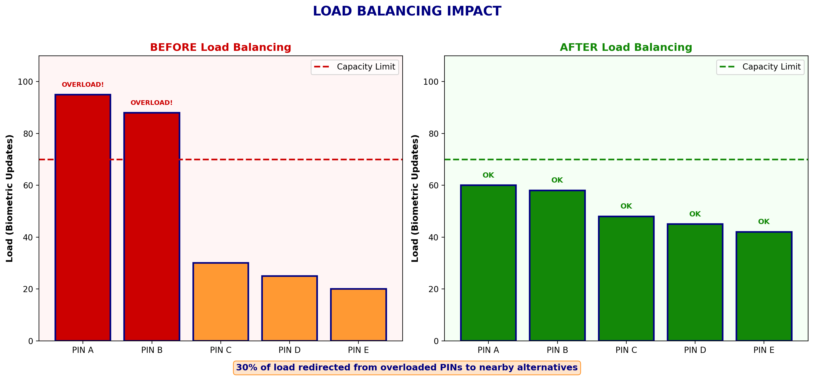

# 🇮🇳 Mobility Signal Index (MSI)
## Detecting Redistribution Patterns in Aadhaar Data

**UIDAI Aadhaar Hackathon 2025**

---

# Executive Summary

We developed **two powerful modules** for Aadhaar data analysis:

1. **Mobility Signal Index (MSI)** — Detects redistribution-like patterns
2. **Biometric Load Balancer** — Forecasts demand & recommends load balancing

## Module 1: MSI Results

| Metric | Value |
|--------|-------|
| **Total Records Analyzed** | 4,938,837 |
| **Districts Covered** | 1,071 |
| **Redistribution Events Detected** | 276 |
| **Wave Patterns Identified** | 14 |
| **Peak MSI Score** | 0.9337 |

## Module 2: Load Balancer Results

| Metric | Value |
|--------|-------|
| **Pincodes Forecasted** | 31,198 |
| **Overloaded Pincodes Identified** | 84 |
| **Alternatives Found (Avg)** | 4.5 per pincode |
| **Max Load Reduction** | 30% (51,551 updates) |

---

# Solution Architecture

## Overall System Design



Our platform consists of **two complementary modules** working on the same Aadhaar data:
- **Module 1 (MSI):** Detects WHERE and WHEN redistribution-like patterns occur
- **Module 2 (Load Balancer):** Predicts WHAT TO DO about operational demand

---

# Problem Statement

> **"Identify meaningful patterns, trends, anomalies, or predictive indicators in Aadhaar enrollment and update data that can support informed decision-making."**

### Our Approach

Traditional analysis looks at absolute numbers. We took a **relational approach** — examining how activity in one district correlates with activity in neighboring districts over time.

**Key Insight:** When District A shows *declining* activity while neighboring districts show *increasing* activity simultaneously, this creates a signal that may indicate population redistribution.

### What We Can Detect
- ✅ Internal migration patterns
- ✅ Seasonal population movements
- ✅ Regional activity imbalances
- ✅ Wave-like spread of activity changes

### Scientific Integrity
We detect **statistical patterns consistent with redistribution** — not proven population movement. Alternative explanations (enrollment camps, seasonal effects) are acknowledged.

---

# Datasets Used

### 1. Aadhaar Enrolment Dataset
- **Records:** 1,006,029
- **Contents:** New Aadhaar registrations by date, state, district, pincode
- **Age Groups:** 0-5 years, 5-17 years, 18+ years

### 2. Aadhaar Demographic Update Dataset
- **Records:** 2,071,700
- **Contents:** Updates to name, address, DOB, gender, mobile number
- **Age Groups:** 5-17 years, 17+ years

### 3. Aadhaar Biometric Update Dataset
- **Records:** 1,861,108
- **Contents:** Fingerprint, iris, and face updates
- **Age Groups:** 5-17 years, 17+ years

### Combined Activity Metric
We created a unified **Total Activity** measure:
```
Total Activity = Enrollments + Demographic Updates + Biometric Updates
```

---

# Methodology

## MSI Analysis Pipeline



## Understanding MSI (Concept Diagram)



## Step 1: Data Aggregation
- Combined all three datasets
- Aggregated to **weekly** level by **district**
- Created geographic neighbor relationships (districts within same state)

## Step 2: Mobility Signal Index (MSI) Calculation

The MSI measures **inverse correlation** between a location and its neighbors:

### MSI Components

| Component | What It Measures |
|-----------|------------------|
| **Inverse Correlation** | Is this district moving opposite to neighbors? |
| **Spatial Spread** | What % of neighbors are moving in opposite direction? |
| **Anomaly Magnitude** | How unusual is this change compared to normal? |

### MSI Interpretation

| MSI Score | Meaning |
|-----------|---------|
| **> 0.5** | 🟠 Very strong redistribution signal |
| **0.3 - 0.5** | 🟠 Strong redistribution signal |
| **0.1 - 0.3** | ⚪ Moderate signal (may be noise) |
| **Near 0** | ⚪ No clear pattern |
| **< 0** | 🟢 Synchronized behavior (normal) |

## Step 3: Wave Pattern Detection
Identified patterns where redistribution signals:
- Start in one district
- Spread to neighboring districts
- Persist for 3+ weeks
- Affect 3+ districts

---

# Results & Visualizations

## Visualization 1: Executive Summary Dashboard


### What This Shows
- **276** redistribution events detected (MSI > 0.3)
- **1,071** districts analyzed across all Indian states
- **Peak MSI of 0.9337** — very strong redistribution signal
- **Top 10 states** ranked by redistribution event count

### Key Finding
**Odisha leads with 31 redistribution events**, followed by Rajasthan (28) and Maharashtra (23). These states show the most frequent "seesaw" patterns where activity drops in one district while rising in neighbors.

---

## Visualization 2: MSI Heatmap (State × Time)


### What This Shows
- Every state (Y-axis) across every week (X-axis)
- **Orange/Saffron** = Positive MSI (redistribution signal)
- **Green** = Negative MSI (synchronized, normal behavior)

### Key Findings
1. **Uttaranchal, Chandigarh, J&K, Pondicherry** show persistent orange bands — frequent redistribution signals
2. **Week 39** shows a distinctive pattern across many states simultaneously
3. **Southern states** (Kerala, Karnataka, Tamil Nadu) show predominantly green — stable, synchronized activity
4. **Smaller UTs** show more volatility in patterns

---

## Visualization 3: Top Redistribution Hotspots


### What This Shows
Top 20 districts ranked by **composite hotspot score** (combining MSI strength, frequency, and spatial spread)

### Top 5 Hotspots

| Rank | District | State | Hotspot Score |
|------|----------|-------|---------------|
| 1 | **Koraput** | Orissa | 0.680 |
| 2 | **Dharashiv** | Maharashtra | 0.673 |
| 3 | **Karaikal** | Pondicherry | 0.665 |
| 4 | **Eastern West Khasi Hills** | Meghalaya | 0.655 |
| 5 | **Jhargram** | West Bengal | 0.654 |

### Key Finding
**Tribal regions and border areas dominate the hotspot list.** Koraput (a tribal-majority district in Orissa) shows the strongest redistribution signal — potentially indicating migration patterns related to livelihood or seasonal work.

---

## Visualization 4: Temporal MSI Analysis


### What This Shows
- **Top Panel:** MSI trend over time
  - Orange line = Mean MSI across all locations
  - Green dashed line = Maximum MSI (peak signals)
  - Shaded area = Variability band
- **Bottom Panel:** Total Aadhaar activity volume by week

### Key Findings

| Period | Pattern | Interpretation |
|--------|---------|----------------|
| **Week 11-14** | Early activity spike | Initial redistribution events |
| **Week 22-27** | Major surge | Peak activity + peak MSI signals |
| **Week 36-40** | Low activity | Possible data gap or monsoon effect |
| **Week 40-52** | Sustained activity | Consistent patterns through year-end |

### Important Insight
**Mean MSI is consistently negative (~-0.15)** — This is expected! Most areas move in sync with neighbors most of the time. The Max MSI spikes (green line reaching 0.9+) show when true redistribution events occurred.

---

## Visualization 5: State-wise MSI Comparison


### What This Shows
- **Left (Green Bars):** Mean MSI per state
- **Right (Blue Diamonds):** Maximum MSI per state (peak redistribution signals)

### State Categories

| Category | States | Characteristics |
|----------|--------|-----------------|
| **High Redistribution** | Uttaranchal, J&K, Pondicherry, Chandigarh | Frequent positive MSI, max signals > 0.8 |
| **Stable/Synchronized** | Kerala, Karnataka, Punjab, Delhi | Consistently negative MSI, low variability |
| **Mixed Patterns** | Odisha, Rajasthan, Maharashtra | High event count but variable signals |

### Key Finding
**Kerala has the most negative mean MSI (-0.248)** — indicating the most synchronized, stable activity patterns. **Uttaranchal is the only state with positive mean MSI (+0.002)** — indicating frequent redistribution-like patterns.

---

## Visualization 6: Wave Pattern Analysis (Gujarat Case Study)


### What This Shows
A detected **wave pattern** in Gujarat showing how redistribution signals spread geographically over time.

### Wave Details

| Metric | Value |
|--------|-------|
| **Wave Score** | 18 (strong) |
| **Origin District** | Banas Kantha |
| **Duration** | Week 12 → Week 27 (15 weeks) |
| **Districts Affected** | 6 |

### Wave Progression

| Week | Districts Showing Signal |
|------|-------------------------|
| W12 | Banas Kantha (origin) |
| W14 | Banas Kantha |
| W22 | Banas Kantha |
| W27 | Banas Kantha, Mahisagar, Mahesana, Botad, Junagadh, Kheda |

### Key Finding
This shows a classic **start → build → spread** pattern. The redistribution signal began in Banas Kantha (northern Gujarat, near Rajasthan border) and spread to 5 neighboring districts. This could indicate seasonal agricultural migration or coordinated administrative activity.

---

# Key Findings Summary

## Finding 1: Redistribution is Rare but Significant
- Only **1.12%** of measurements show strong redistribution (276 out of 24,633)
- When it occurs, signals are **very strong** (peak 0.9337)
- Most areas, most of the time, show **synchronized behavior**

## Finding 2: Geographic Concentration
Hotspots are concentrated in:
| Region Type | Examples |
|-------------|----------|
| **Tribal areas** | Koraput (Orissa), Jhargram (West Bengal) |
| **Border regions** | Multiple J&K districts |
| **Small UTs** | Pondicherry, Chandigarh |
| **Northeast** | Meghalaya districts |

## Finding 3: Temporal Patterns
- **March-July:** Increasing redistribution activity
- **August-September:** Reduced activity (monsoon effect?)
- **October-December:** Sustained high activity

## Finding 4: Wave Propagation Exists
**14 distinct wave patterns** identified where signals spread geographically:

| Rank | State | Origin | Districts Affected | Wave Score |
|------|-------|--------|-------------------|------------|
| 1 | Gujarat | Banas Kantha | 6 | 18.0 |
| 2 | Madhya Pradesh | Sheopur | 7 | 17.5 |
| 3 | Rajasthan | Jhunjhunu, Deeg | 9 | 15.0 |
| 4 | Orissa | Koraput | 8 | 12.0 |
| 5 | Rajasthan | Jalore, Salumbar | 7 | 11.7 |

## Finding 5: State Differences Matter

| State Type | Characteristics | Examples |
|------------|-----------------|----------|
| **High Volatility** | Frequent redistribution signals | J&K, Uttaranchal, Pondicherry |
| **High Stability** | Consistent synchronized activity | Kerala, Karnataka, Punjab |
| **High Volume** | Many events but moderate signals | Odisha, Rajasthan, Maharashtra |

---

# Part 2: Biometric Load Balancer (Ops Impact Module)

## Overview

Beyond pattern detection, we built a **practical operations tool** that forecasts biometric update load and recommends load balancing strategies.

| Metric | Value |
|--------|-------|
| **Pincodes Analyzed** | 31,198 |
| **Critical (Overloaded) Pincodes** | 84 |
| **Avg Alternatives per Overloaded Pincode** | 4.5 |
| **Max Load Reduction Achievable** | 30% |

---

## Load Balancer Pipeline



## Methodology: Load Balancing

### Step 1: Forecast Next Month's Load

For each pincode, we calculate:
- **Baseline:** Last month's biometric updates
- **Trend:** Growth rate over past months
- **Forecast:** Baseline × (1 + damped trend)

### Step 2: Calculate Load Score

```
LoadScore = (Load Percentile × 0.7) + (Spike Risk Percentile × 0.3)
```

| Load Score | Category |
|------------|----------|
| 0.90 - 1.00 | 🔴 Critical (Overloaded) |
| 0.75 - 0.90 | 🟠 High |
| 0.50 - 0.75 | 🟡 Medium |
| 0.00 - 0.50 | 🟢 Low |

### Step 3: Find Alternatives

For each overloaded pincode, we identify:
- Pincodes in the **same district** with spare capacity
- **Adjacent pincodes** (similar pin prefix) if needed
- Rank by **SpareCapacity** (inverse of load)

### Step 4: Simulate Redirection

We simulate: *"What if we redirect X% of load from overloaded pincodes to alternatives?"*

---

## Load Balancer Results

### Visualization 7: Load Balancer Summary Dashboard


**What This Shows:**
- **84 Critical Pincodes** identified (top 10% by load)
- **4.5 alternatives** found per overloaded pincode on average
- **30% max reduction** achievable through load balancing
- Load category distribution (pie chart)
- Forecast load histogram
- Spike risk distribution

---

### Visualization 8: Load Category Distribution


**What This Shows:**
Breakdown of all 31,198 pincodes by load category:

| Category | Description | Count |
|----------|-------------|-------|
| 🟢 **Low** | Load Score 0-50% | Safe, ample capacity |
| 🟡 **Medium** | Load Score 50-75% | Moderate load |
| 🟠 **High** | Load Score 75-90% | Approaching capacity |
| 🔴 **Critical** | Load Score 90-100% | Overloaded, needs attention |

**Key Finding:** Most pincodes (majority) are in Low/Medium categories, but the Critical pincodes account for disproportionate load and need intervention.

---

### Visualization 9: Top 20 Overloaded Pincodes


**What This Shows:**
Side-by-side comparison of **Load Score** (risk metric) and **Forecast Load** (expected updates) for the top 20 overloaded pincodes.

**Top 10 Overloaded Pincodes (Next Month):**

| Rank | Pincode | District | Load Score | Forecast |
|------|---------|----------|------------|----------|
| 1 | 457001 | Ratlam | 0.903 | 12,589 |
| 2 | 491995 | Kawardha | 0.903 | 11,957 |
| 3 | 491335 | Bemetara | 0.903 | 11,331 |
| 4 | 492001 | Raipur | 0.903 | 11,061 |
| 5 | 431001 | Aurangabad | 0.903 | 10,716 |
| 6 | 494226 | Kondagaon | 0.903 | 10,534 |
| 7 | 244001 | Moradabad | 0.902 | 9,576 |
| 8 | 491441 | Rajnandgaon | 0.902 | 9,186 |
| 9 | 491559 | Kawardha | 0.902 | 7,948 |
| 10 | 493118 | Baloda Bazar | 0.902 | 7,846 |

**Key Finding:** Chhattisgarh dominates the overloaded list (6 of top 10 pincodes), suggesting concentrated biometric update demand in this region.

---

### Visualization 10: Load Balancing Simulation


**What This Shows:**
Interactive comparison of **Original Peak Load** vs **Load After Redirection** for different redirection percentages (10%, 15%, 20%, 25%, 30%).

**Simulation Results:**

| Redirection % | Original Peak | After Redirection | Reduction |
|---------------|---------------|-------------------|-----------|
| 10% | 171,838 | 154,654 | 10.0% |
| 15% | 171,838 | 146,062 | 15.0% |
| 20% | 171,838 | 137,470 | 20.0% |
| 25% | 171,838 | 128,878 | 25.0% |
| **30%** | **171,838** | **120,287** | **30.0%** |

**Key Finding:** By redirecting just 30% of expected load from overloaded pincodes to nearby alternatives, we can reduce peak load by **51,551 biometric updates** — potentially preventing service bottlenecks.

---

### Visualization 11: Recommended Alternatives Table


**What This Shows:**
Interactive table showing each overloaded pincode with its district, load score, forecast load, number of alternatives found, and the top recommended alternative pincode.

**Sample Recommendations:**

| Overloaded Pincode | District | Recommended Alternatives |
|--------------------|----------|--------------------------|
| 457001 | Ratlam | 457661, 457772, 457773 |
| 491995 | Kawardha | 491441, 491993 |
| 491335 | Bemetara | 491111, 495224, 491888 |
| 492001 | Raipur | 493229, 493338, 493344 |
| 431001 | Aurangabad | 431114, 431205, 431209 |

**Actionable Output:** For each overloaded pincode, we provide 2-5 nearby alternatives where residents could be directed for faster service.

---

## Visual Impact: Before vs After Load Balancing



This diagram illustrates the core concept: by redirecting a portion of demand from overloaded pincodes (PIN A, PIN B) to nearby alternatives with spare capacity (PIN C, D, E), all centers operate within capacity limits.

---

## Load Balancer Key Insights

### Insight 1: Geographic Concentration
**Chhattisgarh** shows concentrated high load — 6 of top 10 overloaded pincodes are in this state. This suggests need for:
- Additional biometric update centers
- Mobile enrollment camps
- Capacity expansion at existing centers

### Insight 2: Redistribution is Feasible
On average, **4.5 alternative pincodes** are available per overloaded area. This means load balancing is practically achievable without sending residents too far.

### Insight 3: Significant Impact Potential
Even **modest redirection (20%)** reduces peak load by **34,367 updates**. This could:
- Reduce wait times at busy centers
- Prevent system overloads
- Improve citizen experience

---

# Impact & Applications

## For UIDAI Operations
- **Demand Forecasting:** Predict enrollment center needs based on wave patterns
- **Resource Allocation:** Deploy staff to predicted high-activity areas
- **Load Balancing:** Redirect citizens to less busy nearby centers
- **Anomaly Detection:** Flag unusual patterns for investigation

## For Policy Planning
- **Migration Insights:** Proxy indicator for internal population movement
- **Welfare Targeting:** Identify regions with population flux
- **Infrastructure Planning:** Plan services where people are moving TO
- **Capacity Planning:** Know where to build new centers

## For Research
- **Complement Census Data:** Fill gaps between decadal surveys
- **Seasonal Patterns:** Track annual migration corridors
- **Regional Dynamics:** Understand state-level differences

---

# Conclusion

We delivered **two complementary modules** for Aadhaar data analysis:

## Module 1: Mobility Signal Index (MSI)
Detects redistribution-like patterns by analyzing spatial-temporal correlations.

## Module 2: Biometric Load Balancer
Forecasts demand and recommends load balancing strategies.

### What We Delivered

| Deliverable | Details |
|-------------|---------|
| ✅ **MSI Metric** | Novel redistribution detection algorithm |
| ✅ **276 Events Detected** | Across 1,071 districts |
| ✅ **14 Wave Patterns** | Spatial propagation identified |
| ✅ **Load Forecasting** | 31,198 pincodes forecasted |
| ✅ **84 Overloaded Pincodes** | Identified with alternatives |
| ✅ **30% Load Reduction** | Achievable through redirection |
| ✅ **11 Interactive Dashboards** | Indian tricolor themed |

### Key Takeaways

> **Pattern Detection:** In 276 instances, we detected "seesaw" patterns where one area's activity dropped while neighbors increased — potential signals of population redistribution.

> **Operations Impact:** By redirecting 30% of load from overloaded pincodes, peak biometric update demand can be reduced by **51,551 updates** — preventing bottlenecks and improving service.

---

# Appendix: Metric Definitions

| Metric | Definition |
|--------|------------|
| **MSI Score** | Measure of inverse correlation between a district and its neighbors |
| **Hotspot Score** | Composite ranking combining MSI strength, frequency, and spatial spread |
| **Wave Score** | Measure of how widely a pattern propagated geographically |
| **Load Score** | Combination of forecast load percentile and spike risk |
| **Spare Capacity** | Inverse of load percentile (available capacity for redirection) |

---

# All Visualizations (11 Total)

## Part 1: MSI Analysis (6 dashboards)
| # | File | Description |
|---|------|-------------|
| 1 | `msi_visualizations/summary_dashboard.html` | Executive summary with key metrics |
| 2 | `msi_visualizations/msi_heatmap.html` | State × Time heatmap |
| 3 | `msi_visualizations/hotspot_ranking.html` | Top 20 redistribution hotspots |
| 4 | `msi_visualizations/temporal_analysis.html` | MSI trends over time |
| 5 | `msi_visualizations/state_comparison.html` | State-wise MSI comparison |
| 6 | `msi_visualizations/wave_visualization.html` | Wave pattern analysis |

## Part 2: Load Balancer (5 dashboards)
| # | File | Description |
|---|------|-------------|
| 7 | `load_balancer_visualizations/summary_dashboard.html` | Load balancer executive summary |
| 8 | `load_balancer_visualizations/load_distribution.html` | Load category distribution |
| 9 | `load_balancer_visualizations/top_overloaded.html` | Top 20 overloaded pincodes |
| 10 | `load_balancer_visualizations/simulation.html` | Load balancing simulation |
| 11 | `load_balancer_visualizations/recommendations_table.html` | Alternative recommendations |

---

**Theme:** 🇮🇳 Indian Tricolor — Saffron • White • Green

*Analysis conducted on publicly available aggregated Aadhaar data. No individual-level information was accessed.*
